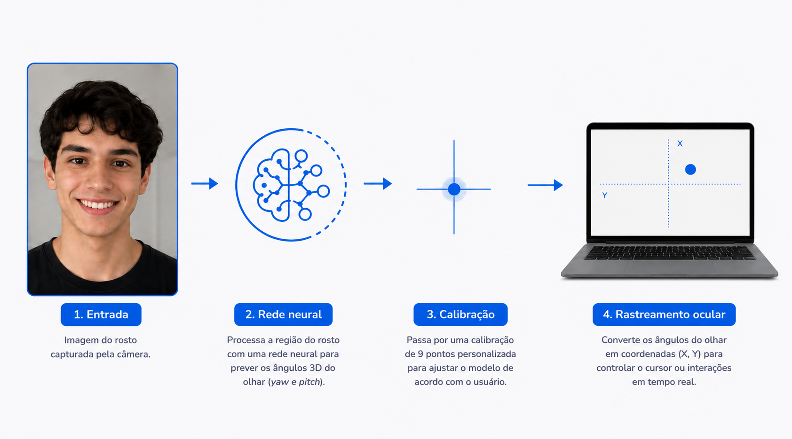

# IrisFlow

Tecnologia assistiva de rastreamento ocular por webcam comum, desenvolvida para pessoas com Esclerose Lateral Amiotrófica (ELA) e outras condições severas de restrição motora.


[](https://github.com/ZambePy/demo01/actions/workflows/ci.yml)
[](LICENSE)


---

## Visão Geral

O IrisFlow estima o ponto de fixação do olhar na tela a partir de imagens de uma webcam comum, sem hardware especializado. O usuário navega, se comunica e interage usando apenas o movimento dos olhos.

O sistema combina detecção de landmarks faciais (MediaPipe), uma rede neural de estimativa de olhar (L2CS-Net, executada via ONNX Runtime no browser) e um regressor treinado em tempo real durante uma calibração personalizada. **Todo o processamento ocorre localmente no dispositivo** — nenhuma imagem, dado facial ou perfil de calibração é enviado para a nuvem.

Domínios de aplicação: comunicação aumentativa e alternativa (CAA), acessibilidade computacional, e pesquisa em interação humano-computador.

---

## Principais Recursos

### Calibração Personalizada

Grade de pontos de fixação cuja posição é derivada de um **orçamento de excentricidade angular**, não de frações fixas da tela. A posição dos alvos depende do tamanho físico do monitor e da distância de uso, porque o olho humano apresenta hipometria — subalcance sistemático — em excentricidades altas. Modo completo (9 pontos) e modo rápido (4 cantos) para recalibração pontual.

### Preparação Automática do Posto de Uso

Antes da calibração, o sistema mede as condições reais de captura e as corrige quando possível:

- **Ajuste automático da câmera em malha fechada** — mede o tamanho do rosto no frame e ajusta zoom, brilho e contraste até atingir a densidade-alvo de pixels sobre o olho. Quando o driver não expõe esses controles, o sistema informa qual ação física é necessária em vez de fingir que ajustou.
- **Verificação de prontidão ao vivo** — distância, enquadramento, postura da cabeça, iluminação, contraste, reflexo em lentes e cintilação da rede elétrica, todos medidos e exibidos antes de gastar tempo de coleta com dado ruim.
- **Geometria física lida do sistema** — a diagonal do monitor vem do EDID, não de digitação, porque errar esse número faz o erro angular reportado divergir do real.

### Estimativa de Olhar por Rede Neural

L2CS-Net treinada no dataset Gaze360, exportada para ONNX e executada em Web Worker. Entrada: recorte facial 448×448 normalizado (ImageNet). Saída: ângulos *yaw* e *pitch* decodificados de 90 bins por eixo via expectativa da softmax.

### Interface para CAA

Fundo escuro de alto contraste, alvos grandes, linguagem direta sem jargão. Seleção por *dwell* (fixação prolongada) com tempo configurável, bloqueio automático em estado degradado e botão de emergência com prioridade máxima.

---

## Arquitetura



O diagrama acima resume o fluxo. Em detalhe:

```
Câmera (getUserMedia, 1920×1080)
    │
    ├── Ajuste automático da câmera ──→ zoom / brilho / contraste / anticintilação
    │       Malha fechada sobre o tamanho do rosto no frame.
    │
    ├── MediaPipe FaceLandmarker ──→ 478 landmarks 3D normalizados [0..1]
    │
    ├── L2CS-Net (ONNX, Web Worker) ──→ yaw / pitch do olhar (cadência 100 ms)
    │       Ângulos implausíveis são rejeitados, não clampeados.
    │
    ├── extractCompactFeatures ──→ vetor completo (37 dims + bloco angular)
    │       └── projeção no conjunto ativo ──→ 12 dims/olho
    │           (offsets de íris, posições relativas, contorno da íris)
    │
    ├── EyeQualityAnalyzer ──→ brilho / contraste / borrão / reflexo especular
    │       Filtra frames ruins antes de armazenar na calibração.
    │
    ├── Calibração (grade por orçamento de excentricidade)
    │       StandardScaler + Ridge com penalidade anisotrópica Σ_W,
    │       λ por validação cruzada leave-one-target-out.
    │
    ├── OneEuroFilter2D ──→ suavização adaptativa jitter × lag
    │
    └── GazeContext (React) ──→ Dwell Click | Navegação | Emergência
```

---

## Estrutura do Repositório

```
src/                          # Núcleo do pipeline (TypeScript puro, sem DOM onde possível)
  tracker/engine.ts           # Loop rAF principal, estados e diagnósticos
  calibration.ts              # Coleta, treino, inferência e diagnóstico de ajuste
  extractor.ts                # Extração de features e conjunto ativo
  featurePipeline.ts          # Fronteira consumida pelo engine
  ridge.ts                    # Ridge com penalidade Σ_W e CV de λ
  setupReadiness.ts           # Avaliação do posto de uso (puro, testável)
  cameraTuner.ts              # Lei de controle do ajuste automático da câmera
  flickerDetector.ts          # Detecção de cintilação da rede elétrica
  displayGeometry.ts          # Geometria física da tela a partir do EDID
  qualityAnalyzer.ts          # Métricas de qualidade por frame
  oneEuroFilter.ts            # Filtro temporal adaptativo
  accuracy.ts                 # Teste de precisão e relatório de sessão
  l2cs/                       # Worker L2CS-Net (ONNX), recorte e decodificação
  testUtils/gazeSimulator.ts  # Simulador determinístico para benchmarks

frontend/src/
  pages/                      # Telas (calibração, menu, jogos, teclado, emergência)
  context/GazeContext.tsx     # Estado global de gaze, dwell e câmera
  components/ui/              # Componentes desenhados para interação ocular

electron/                     # Processo principal, preload e IPC de sistema
docs/                         # Auditorias, baselines e resultados de sprint
fixtures/replay/              # Gravações determinísticas (não versionadas)
```

---

## Compatibilidade de Plataforma

| Plataforma | Estado |
|---|---|
| Windows 10/11 (Electron) | Testado — inclui leitura de EDID via WMI |
| Navegador Chromium (Chrome, Edge) | Testado — sem acesso à geometria do sistema |
| Linux / macOS | Não testado — o núcleo é agnóstico, o IPC de sistema é específico do Windows |

Os controles de câmera (`zoom`, `brightness`, `contrast`, `powerLineFrequency`) são constraints opcionais do padrão MediaStream e dependem do driver. O sistema sonda as capacidades disponíveis e degrada informando qual ajuste físico é necessário.

---

## Configuração do Ambiente

Requer Node.js 22.12 ou superior (o CI roda em Node 24).

```bash
git clone <url-do-repositorio>
cd irisflow
npm install
npm --prefix frontend install
```

---

## Requisitos de Hardware

### Mínimo

| Componente | Especificação |
|---|---|
| Webcam | 1280×720 @ 30 fps |
| Processador | Quad-core com suporte a WebAssembly SIMD |
| Memória | 8 GB |
| GPU | Aceleração por WebGL (delegate GPU do MediaPipe) |

### Recomendado

| Componente | Especificação | Motivo |
|---|---|---|
| Webcam | 1920×1080, campo de visão estreito | O erro de rastreamento escala com o inverso da densidade de pixels sobre o olho |
| Posicionamento | Câmera independente do monitor | Permite aproximar a câmera sem aproximar a tela |
| Iluminação | Luz difusa frontal | Contraste na borda da íris é o que ancora o landmark |
| Apoio de cabeça | Encosto occipital | Reduz o confundimento entre pose e olhar |

> **Sobre o campo de visão:** webcams grande-angulares (90° ou mais) são projetadas para videochamada e espalham a cena pelo sensor. O rosto ocupa uma fração pequena do frame e o deslocamento da íris — o sinal útil do pipeline inteiro — fica reduzido a poucos pixels. Uma lente mais estreita, ou a câmera mais próxima do rosto, melhora a precisão proporcionalmente.

---

## Executando o IrisFlow

### Desenvolvimento (Web)

```bash
npm run dev
```

Acesse `http://localhost:5173`.

### Desktop (Electron)

```bash
npm run electron:dev
```

Necessário para leitura da geometria física da tela e para o controle de mouse do sistema operacional.

### Gerar Instalador

```bash
npm run electron:build
```

O instalador é gerado em `release/`.

### Replay Determinístico

```bash
npm run replay -- <arquivo.jsonl>
```

Reexecuta o pipeline sobre uma gravação, permitindo comparar configurações sem introduzir ruído de nova sessão.

---

## Modelos Pré-treinados

| Modelo | Arquivo | Tamanho | Origem |
|---|---|---|---|
| L2CS-Net | `frontend/public/models/l2cs/l2cs_gaze360.onnx` | 92 MB | Treinado em Gaze360; 90 bins/eixo, entrada 448×448 |
| Face Landmarker | `frontend/public/mediapipe/models/face_landmarker.task` | 3,6 MB | MediaPipe Tasks Vision, 478 landmarks com íris |

Ambos são carregados localmente. O worker L2CS deve estar em estado `ready` antes de iniciar a calibração.

---

## Fluxo de Calibração

1. **Pré-calibração.** O usuário se vê na tela enquanto o sistema mede distância, enquadramento, postura, iluminação, contraste, reflexo e cintilação. O ajuste automático da câmera roda em paralelo. Condições fora da faixa geram aviso; apenas ausência de rosto ou câmera inadequada impedem prosseguir.
2. **Coleta.** Alvos apresentados em ordem embaralhada, com descarte dos primeiros 400 ms de cada ponto (fase de sacada e acomodação). Frames são filtrados por qualidade e por deriva de pose dentro do ponto.
3. **Treino.** `StandardScaler` seguido de Ridge com penalidade anisotrópica derivada da covariância intra-alvo, com λ escolhido por validação cruzada leave-one-target-out.
4. **Teste de precisão.** Grade 3×3 em 25/50/75%, deliberadamente disjunta da grade de calibração. Um guarda detecta e reporta qualquer sobreposição entre as duas grades, porque validar nas posições do treino mediria memorização.
5. **Relatório.** JSON com métricas, diagnósticos por ponto, decomposição afim do erro, diagnóstico de ajuste (erro de treino e leave-one-target-out) e as condições **medidas** da sessão.

---

## Precisão e Reprodutibilidade

O relatório de sessão registra, além do erro médio:

| Métrica | O que separa |
|---|---|
| `calibrationFit.trainErrorPx` | Se o modelo sequer reproduz os próprios alvos de treino |
| `calibrationFit.looErrorPx` | Generalização estimada apenas com dados de calibração |
| `affine.residualPx` | Quanto do erro é mapeamento afim errado *versus* ruído incoerente |
| `poseDrift` | Deriva de pose entre o início do teste e cada ponto |
| `validationOverlap` | Contaminação entre grade de treino e de validação |

A comparação entre `looErrorPx` e o erro do teste é o que distingue "o modelo é o limite" de "algo mudou entre calibrar e testar".

> **Sobre números de precisão:** o menor erro registrado neste projeto foi 57 px / 0,9°, obtido em condições controladas num notebook de 15,6" (documentado em `docs/PONTO-DE-REFERENCIA.md`). Esse número **não é reproduzível em qualquer configuração** — erro em pixels depende do tamanho da tela, e erro angular depende da distância. Qualquer comparação exige que as condições de captura sejam as mesmas, e é por isso que o relatório grava as condições medidas junto com o resultado.

---

## Documentação

| Documento | Conteúdo |
|---|---|
| `docs/PONTO-DE-REFERENCIA.md` | Baseline de precisão e condições exatas de captura |
| `docs/RESULTADOS-D2-D8.md` | Consolidação da semana de precisão, decisões e pendências |
| `docs/AUDITORIA-SPRINT-0.md` | Auditoria de tratamento silencioso de erros |
| `docs/BUG-OCULOS-EVIDENCIA.md` | Investigação do impacto de lentes na precisão |
| `ROADMAP.md` | Sprints, status e critérios de aceite |
| `PLANO-FRENTES-A-B.md` | Roadmap técnico e regras de desenvolvimento |

---

## Testes

```bash
npm test                      # Núcleo do pipeline (Vitest)
npm --prefix frontend test    # Interface (Vitest + jsdom)
npm run build                 # Verificação de tipos estrita + build de produção
```

Todas as etapas acima, mais as verificações de tipo do núcleo e do Electron,
rodam a cada push e pull request via [GitHub Actions](.github/workflows/ci.yml).
O badge no topo reflete o estado da branch `main`.

A cobertura concentra-se nos módulos puros, onde os limiares e as leis de controle vivem: avaliação de prontidão, ajuste de câmera, detecção de cintilação, geometria de tela, regressão, filtros e decodificação do L2CS. Benchmarks por região (centro, bordas, cantos e transições) rodam sobre um simulador determinístico.

---

## Privacidade

Nenhuma imagem, dado facial, perfil de calibração ou telemetria sai do dispositivo. Toda inferência é local. A leitura de configurações do sistema operacional (tamanho físico do monitor) só ocorre após consentimento explícito do cuidador.

---

## Licença

Distribuído sob a **GNU General Public License v3.0**. O texto completo está em [`LICENSE`](LICENSE).

A GPLv3 garante que qualquer trabalho derivado permaneça livre e com o código
aberto. Para uma tecnologia assistiva, isso importa em concreto: se o projeto
for descontinuado ou bifurcado, quem depende dele para se comunicar continua
tendo direito ao código que faz o equipamento funcionar.
